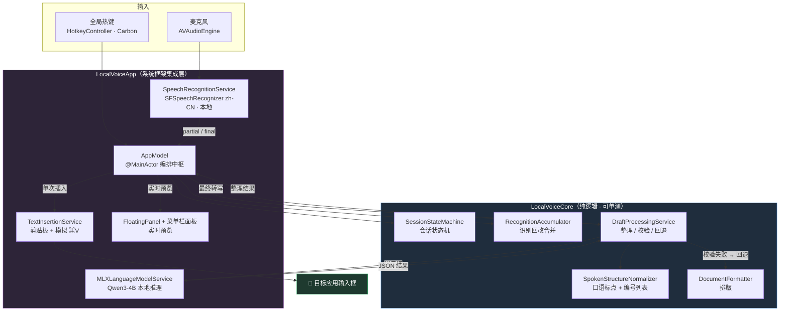
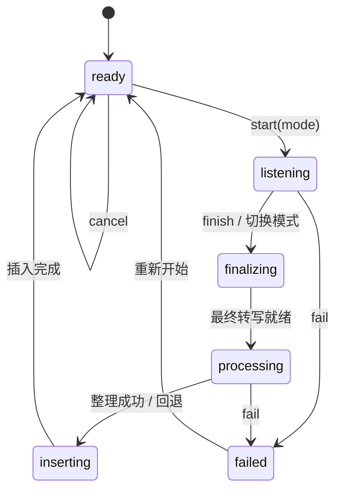

# LocalVoice

一款**完全离线、隐私优先**的 macOS 菜单栏语音输入工具。按下快捷键即可对任意应用的输入框进行普通话语音听写，或「中文 → 英文」语音翻译。语音识别、文本整理与翻译全部在本机完成，音频与文字不会离开设备。

> 录音过程中**不**向目标应用写入临时文本，只在底部悬浮条预览；停止后才执行一次「整段语义整理 → 单次插入」，避免光标跳动与脏文本。

---

## ✨ 特性

- 🎙️ **本地语音识别** —— Apple `Speech` 框架，`requiresOnDeviceRecognition`，纯离线
- 🧠 **本地大模型整理** —— MLX `Qwen3-4B`，去口语、补标点、结构化；不可用时自动降级为规则整理
- 🌐 **中译英模式** —— 普通话语音直接输出自然英文
- 🗒️ **口语结构化** —— 「句号 / 逗号 / 另起一段」转标点；「第一点…第二点…」转编号列表
- 🔒 **隐私** —— 音频、转写、提示词、模型输出全程留在本机
- ⌨️ **全局快捷键** + 菜单栏常驻，无 Dock 图标

---

## 🚀 快速上手

### 环境要求
- macOS 26 / Apple Silicon (`arm64`)
- Xcode 26、`xcodegen`（`brew install xcodegen`）

### 构建与运行
```bash
./scripts/run.sh              # 一键：退出旧实例 → 构建签名 → 重新启动
```
等价于手动分两步：
```bash
./scripts/build-app.sh        # 构建并签名，产物在 build/LocalVoice.app
open build/LocalVoice.app     # 启动，图标出现在菜单栏
swift test                    # 运行纯逻辑单元测试
```

首次运行需授予 **麦克风**、**语音识别**、**辅助功能** 三项权限。

> **权限不会反复弹窗**：`run.sh` / `build-app.sh` 用固定的 `Apple Development` 证书签名，macOS 据此把每次重编译都识别为**同一个 App**（同一签名身份 + `com.localvoice.app`），已授予的权限保留——相当于每次 bug 修复都算作一次「软件更新」。
>
> ⚠️ 切勿用 `xcodebuild ... CODE_SIGNING_ALLOWED=NO` 直接从 `DerivedData` 启动：那是 ad-hoc 临时签名，每次构建签名都不同，会被 macOS 当成全新 App，导致权限重置、反复弹窗。

### 使用
| 操作 | 默认快捷键 | 说明 |
|------|-----------|------|
| 听写模式 | `⌘⇧D` | 识别普通话，整理后写入当前输入框 |
| 英文模式 | `⌘⇧E` | 识别普通话，本地翻译为英文后写入 |
| 停止并插入 | 再按一次同一快捷键 / 点击悬浮条勾号 | 触发最终整理与插入 |
| 取消 | 点击悬浮条 ✕ | 丢弃本次会话 |

快捷键可在菜单栏面板点击「快捷键胶囊」后重新录制。本地模型可在菜单栏面板内下载（约数 GB）；未下载时听写仍可用，仅不做语义级整理/翻译。

---

## 🏗️ 架构总览



**会话流程（状态机）**



> 录音中**不写入**目标应用，仅预览；用户停止后才在 `processing` 阶段调用本地模型整段整理，并在 `inserting` 阶段执行**唯一一次**跨应用插入。

---

## 📂 项目结构

```
LocalVoice/
├── project.yml              # XcodeGen 工程定义（App 构建入口，单一来源）
├── Package.swift            # SPM：暴露 LocalVoiceCore 库供 swift test
├── scripts/run.sh           # 一键：构建 + 签名 + 重启（日常开发用）
├── scripts/build-app.sh     # 构建 + 固定证书签名（run.sh 内部调用）
├── Sources/
│   ├── LocalVoiceCore/      # 纯逻辑、无 UI、可测试
│   │   ├── LocalVoiceCore.swift     # 状态机 / 快捷键 / 文本累加 / 校正
│   │   └── DraftProcessing.swift    # 整理：提示词 / 校验 / 回退 / 口语结构化
│   └── LocalVoiceApp/       # macOS App（AppKit + SwiftUI + 系统框架）
│       ├── AppModel.swift              # ★ 会话编排中枢
│       ├── SpeechRecognitionService.swift
│       ├── MLXLanguageModelService.swift / LocalModelManager.swift
│       ├── TextInsertionService.swift / HotkeyController.swift
│       ├── PermissionCoordinator.swift
│       └── FloatingPanelController.swift / MenuBarContentView.swift
├── Tools/                   # 基准工具 + 质量语料生成
├── Tests/                   # LocalVoiceCore 单元测试 + 语料 fixture
└── docs/                    # 设计方案、实现报告、模型评测
```

**分层原则**：可单测的纯逻辑（状态机、文本算法、提示词、校验）全部放 `LocalVoiceCore`，不依赖 AppKit；`LocalVoiceApp` 只负责把系统框架（Speech / MLX / AX / Carbon）接到这些纯逻辑上。

---

## 📦 打包封装

```bash
./scripts/build-app.sh
```
1. `xcodegen generate` —— 从 `project.yml` 生成 `LocalVoice.xcodeproj`
2. `xcodebuild` —— Release / `arm64` 构建
3. `ditto` —— 复制产物到 `build/LocalVoice.app`
4. **签名** —— 有 `Apple Development` 证书则逐 framework 签名 + Hardened Runtime + entitlements；无证书则 ad-hoc（仅本机自用）

> 用固定的 `Apple Development` 证书签名后，重复构建的签名身份一致，macOS 据此保留已授予的权限（麦克风 / 语音识别 / 辅助功能），重编译不再反复弹窗。
>
> 分发给他人需用 Developer ID 证书签名并**公证（notarization）**，否则会被 Gatekeeper 拦截。

---

## 📖 深入文档

- **[docs/ARCHITECTURE.md](docs/ARCHITECTURE.md)** —— 完整架构、内部逻辑详解、关键文件速查
- [docs/plans/](docs/plans/) —— 设计方案（开源模型处理、标点/列表结构化）
- [docs/reports/](docs/reports/) —— 本地模型评测数据

---

## 🧪 测试与质量

- `swift test` —— `LocalVoiceCoreTests`（Swift Testing），覆盖状态机、快捷键、文本累加/稳定化、校正、草稿整理、插入请求等
- 质量语料 `Tests/Fixtures/processing-quality-corpus.json` 由 `Tools/generate_quality_corpus.swift` 生成，`ProcessingQualityEvaluator` 判定整理结果是否保留事实/语义/结构
- `LocalVoiceBenchmark` —— 跑真实模型，输出 token 速率、首字延迟、整体耗时
