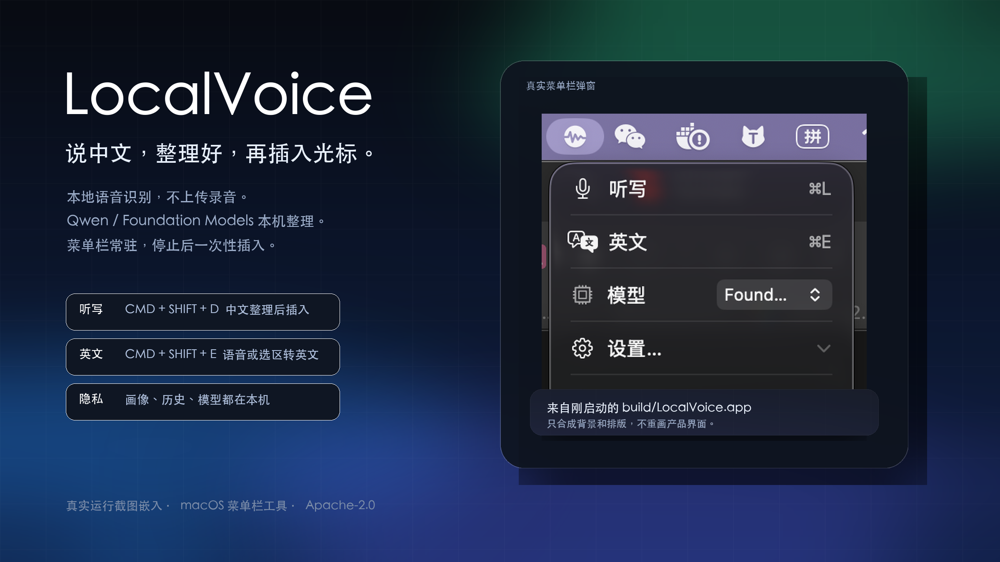
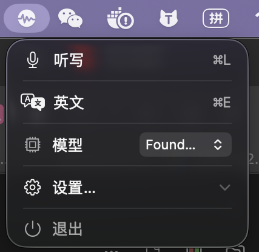

# LocalVoice



本地运行的 macOS 语音输入工具。按快捷键说中文，LocalVoice 在底部预览文字，停止后整理成可直接发送的文本，再插入当前光标位置。

它不是云端听写套壳。语音识别、文本整理、中文转英文、个人词汇学习都在这台 Mac 上完成。

[宣传页](docs/site/index.html) · [隐私说明](PRIVACY.md) · [架构文档](docs/ARCHITECTURE.md) · [模型评测](docs/reports/2026-06-12-localvoice-model-evaluation.md) · [Releases](https://github.com/Paikchu/LocalVoice/releases)

## 适合谁

- 经常用中文写邮件、IM、文档、Issue，不想把录音和原文发到云端。
- 需要把口语整理成干净文本，而不是逐字转写一堆“嗯、那个、然后”。
- 中英文混用频繁，需要把中文口述或选中的中文快速转成英文。
- 在意光标位置。停止录音后一次性插入，不边听边污染目标输入框。

## 核心能力

- **本地听写**：使用 Apple Speech 的本机识别能力，录音不上传。
- **本地整理**：Qwen3 4B 通过 MLX 在 Apple Silicon 上运行，下载后可离线。
- **Foundation Models 可选**：也可以切到 macOS 提供的系统模型，无需额外下载。
- **中文转英文**：按英文快捷键，说中文，输出自然英文。
- **选区翻译**：选中中文后按英文快捷键，预览译文，再原位替换。
- **个人词汇学习**：从已确认插入的文本里学习术语、联系人、常见写法。
- **剪贴板兜底**：目标输入框失效或选区变化时，不乱覆盖，结果留在剪贴板。
- **可清除数据**：画像、历史、模型、签名、快捷键设置都能从菜单栏清掉。

## 使用体验



| 操作 | 默认快捷键 | 结果 |
|---|---:|---|
| 中文听写 | `⌘⇧D` | 说中文，停止后整理并插入当前光标 |
| 中文转英文 | `⌘⇧E` | 说中文，停止后插入英文 |
| 翻译选中文本 | 选中中文后按 `⌘⇧E` | 预览英文，确认后替换原选区 |
| 停止并插入 | 再按一次当前快捷键 | 结束录音，整理，单次插入 |
| 取消 | 点击悬浮条关闭按钮 | 丢弃本次内容 |

录音时只显示预览，不写入目标应用。停止后才进入整理和插入阶段，所以不会在微信、飞书、邮件、浏览器输入框里留下半截脏文本。

## 安装

### 下载 DMG

从 [GitHub Releases](https://github.com/Paikchu/LocalVoice/releases) 下载 `LocalVoice-<version>-arm64.dmg`，拖到 Applications。

当前公开 DMG 未经过 Apple 公证。首次打开时 macOS 可能拦截：

- 打开一次 `LocalVoice.app`。
- 进入“系统设置 → 隐私与安全性”。
- 点击“仍要打开”。

首次运行需要授予：

- 麦克风
- 语音识别
- 辅助功能

辅助功能权限用于把最终文本粘贴到当前应用的光标位置。

### 本地模型

菜单栏里可以选择模型：

| 模型 | 特点 |
|---|---|
| Qwen | 约 2.3 GB，首次下载需要联网，下载后离线运行 |
| Foundation Models | macOS 提供，无需额外下载，能力取决于系统可用性 |

Qwen 固定到 `mlx-community/Qwen3-4B-Instruct-2507-4bit` 的指定 commit，避免上游 `main` 变化后模型内容静默漂移。

## 隐私边界

LocalVoice 不包含遥测、广告或分析 SDK。

本地数据位置：

```text
~/Library/Application Support/LocalVoice/profile.json
~/Library/Application Support/LocalVoice/history/
~/Library/Application Support/LocalVoice/Models/
```

“清除全部本地数据”会删除画像、历史、模型缓存、邮件签名和快捷键设置。macOS 系统权限需要在“系统设置 → 隐私与安全性”里单独撤销。

## 性能基准

本地模型评测环境：Apple M5，24 GB 内存，macOS 26.5.1，200 条中文邮件和普通听写样本。

| 指标 | 结果 |
|---|---:|
| 本地整理 P95 | 1.66 秒 |
| 首 token P95 | 0.29 秒 |
| 生成速度 P50 | 44.77 tokens/s |
| 2.5 秒内完成 | 200/200 |
| 语义与结构通过 | 200/200 |

完整数据见 [模型评测报告](docs/reports/2026-06-12-localvoice-model-evaluation.md)。

## 从源码运行

要求：

- macOS 26
- Apple Silicon
- Xcode 26
- `xcodegen`

```bash
brew install xcodegen
./scripts/run.sh
```

常用命令：

```bash
./scripts/build-app.sh        # 构建并签名到 build/LocalVoice.app
open build/LocalVoice.app     # 启动菜单栏应用
swift test                    # 运行 LocalVoiceCore 单元测试
./scripts/package-dmg.sh      # 生成未公证 DMG 和 SHA256SUMS
```

不要从 `DerivedData` 里直接启动 ad-hoc 构建。开发脚本会用固定签名身份生成 `build/LocalVoice.app`，macOS 才会把重编译视为同一个 app，已授予的麦克风、语音识别和辅助功能权限也能稳定保留。

## 项目结构

```text
LocalVoice/
├── Sources/LocalVoiceCore/      # 状态机、文本整理、提示词、校验、画像逻辑
├── Sources/LocalVoiceApp/       # AppKit + SwiftUI + Speech + MLX + AX 集成
├── Tests/                       # Swift Testing 单元测试和质量语料
├── Tools/LocalVoiceBenchmark/   # 本地模型性能和质量基准
├── docs/                        # 架构、设计方案、评测报告
├── scripts/build-app.sh         # Release 构建和稳定签名
└── scripts/package-dmg.sh       # DMG 打包
```

核心原则：能测试的逻辑放在 `LocalVoiceCore`，系统集成留在 `LocalVoiceApp`。状态机、文本算法、模型输出校验和隐私数据路径都能单独验证。

## 技术栈

- Swift 6
- SwiftUI + AppKit MenuBarExtra
- Apple Speech，本机识别
- Accessibility API，跨应用插入和选区替换
- MLX Swift LM，本地 Qwen 推理
- Hugging Face Swift，模型下载
- Swift Testing，核心逻辑回归测试

## 许可证

Apache-2.0。详见 [LICENSE](LICENSE)。
