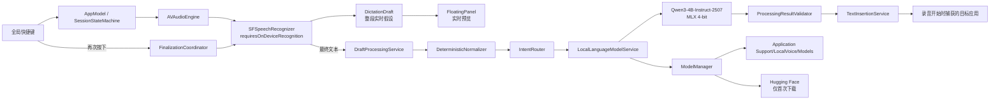
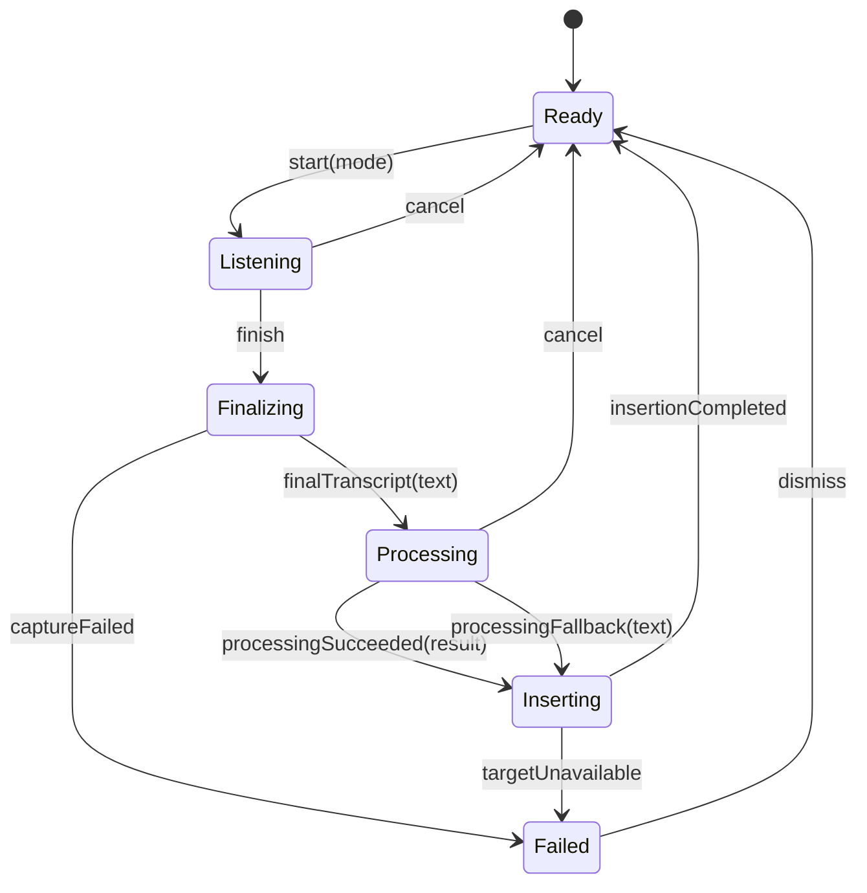
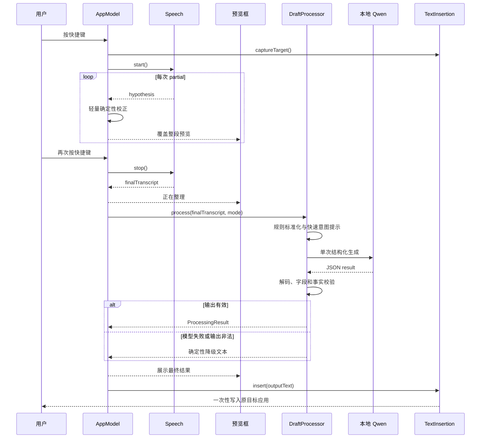
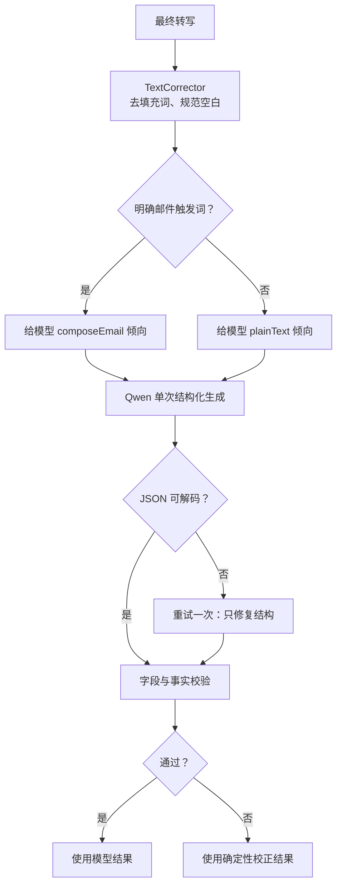
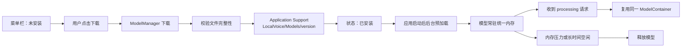
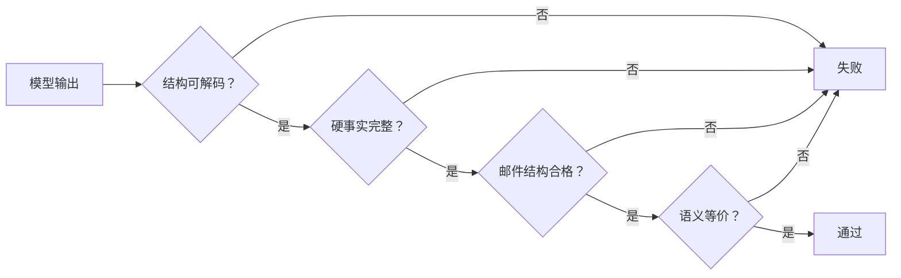
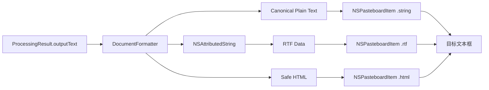

# LocalVoice 开源本地模型处理方案

> 调研与代码基线：2026-06-12

## 目标

- 录音期间只在底部悬浮窗显示实时识别结果，不向目标应用写入 partial 文本。
- 用户再次按下快捷键后，等待最终识别结果，再执行整段意图识别与文本整理。
- 普通听写输出去口语化、修正标点后的文本。
- 邮件命令移除命令前缀，生成适合直接使用的邮件正文。
- 音频、转写、提示词和模型输出全部留在本机。
- 处理完成后只执行一次跨应用插入。

## 当前基线

- `FloatingPanelController` 已包含 `360 × 118 pt` 的预览框与底部控制条。
- `DictationDraft` 已实现实时覆盖、单次确认和取消清空。
- `AppModel` 已停止实时写入，最终确认后才调用 `TextInsertionService.insert`。
- `TextInsertionService` 已捕获原目标应用，并通过临时剪贴板完成跨应用插入。
- 麦克风、语音识别与辅助功能权限已拆分，录音不再依赖辅助功能授权。
- 当前状态机仍只有 `ready / listening / finalizing / failed`，没有本地模型加载和文本处理状态。
- 当前听写模式在最终识别后直接插入，尚未经过意图识别和 LLM 整理。
- 当前英文模式仍对 partial 文本持续调用系统翻译，不符合“整段完成后统一处理”的目标架构。
- 当前 `OSLog` 使用 `.public` 记录完整转写和插入文本，必须在本地模型功能上线前移除。
- 当前测试基线为 `30` 项，`swift test` 全部通过。

## 架构



### 模块边界

| 模块 | 责任 | 不负责 |
| --- | --- | --- |
| `AppModel` | 会话编排、状态发布、取消任务 | 拼接提示词、解析模型输出 |
| `SessionStateMachine` | 限制合法状态转换 | 调用系统框架 |
| `DictationDraft` | 保存 raw、preview、final 文本 | 文本生成 |
| `DraftProcessingService` | 组织规则处理、意图路由和 LLM 请求 | 模型下载 |
| `IntentRouter` | 判断普通听写或邮件命令 | 生成邮件正文 |
| `LocalLanguageModelService` | 加载模型、执行推理、返回原始响应 | UI 与文本插入 |
| `ProcessingResultValidator` | JSON 解码、字段校验、事实保护 | 修改业务状态 |
| `ModelManager` | 下载、校验、版本、加载和卸载 | 生成文本 |
| `TextInsertionService` | 单次插入与剪贴板恢复 | 转写、推理 |

## 状态机



### 状态语义

- `listening`：持续接收 partial，更新预览，不调用 LLM，不写入目标应用。
- `finalizing`：停止音频，等待 Speech 最终结果；`700 ms` 只作为兜底，不作为固定延迟。
- `processing`：锁定最终文本，执行意图识别和本地生成；悬浮窗显示“正在整理”。
- `inserting`：输出已验证，只允许调用一次 `TextInsertionService.insert`。
- `failed`：保留可恢复的草稿，不静默丢失用户内容。

## 完整逻辑



## 处理结果协议

```swift
public enum DraftIntent: String, Codable, Sendable {
    case plainText
    case composeEmail
}

public struct EmailDraft: Codable, Equatable, Sendable {
    public let subject: String?
    public let recipient: String?
    public let body: String
    public let missingFields: [String]
}

public struct ProcessingResult: Codable, Equatable, Sendable {
    public let intent: DraftIntent
    public let confidence: Double
    public let outputText: String
    public let email: EmailDraft?
}
```

- `outputText` 是本阶段唯一允许插入目标应用的字段。
- `composeEmail` 的 `outputText` 默认只包含可粘贴的邮件正文。
- `subject` 和 `recipient` 先用于预览和后续 Mail 集成，不在当前跨应用粘贴阶段自动操作。
- `confidence < 0.85` 时强制按 `plainText` 处理。
- `missingFields` 只报告缺失项，不允许模型猜测联系人、日期或签名。

## 意图与生成策略



- 规则层只提供倾向，不独立决定最终意图。
- 触发词包括“发邮件、写封邮件、帮我回复邮件、给某人写邮件”等明确动作表达。
- “我收到一封邮件”“这段话提到了发邮件”不得被判定为命令。
- 模型输入只包含最终转写、当前模式、用户本地签名和固定系统提示词。
- 不读取当前应用正文，不抓取屏幕，不把其他应用内容加入提示词。
- 模型最大输出限制在约 `384 tokens`，温度建议 `0.1`，关闭思考输出。
- JSON 解码失败只重试一次；第二次失败立即降级，不阻塞用户。

## 邮件整理规则

- 删除“我想发一封邮件”“你帮我写一下”等命令文本。
- 保留原文中的人名、公司名、时间、金额、链接、编号和明确承诺。
- 删除口语重复与无语义填充词。
- 根据正文生成简短主题，但不自动操作邮件客户端。
- 已知收件人称呼时生成问候语；未知时使用中性问候，不猜姓名。
- 使用本地设置中的姓名和签名；未设置时不生成虚构签名。
- 不补充原文没有的会议时间、附件、截止日期或行动承诺。
- 输出语言跟随用户正文；英文模式固定输出英文。

## 开源模型评估

### 结论

首版推荐：

```text
Qwen3-4B-Instruct-2507
运行格式：MLX 4-bit
运行时：MLX Swift LM
模型来源：mlx-community/Qwen3-4B-Instruct-2507-4bit
```

### 候选比较

| 模型 | 适配度 | 优点 | 风险 | 结论 |
| --- | ---: | --- | --- | --- |
| `Qwen3-4B-Instruct-2507` | 高 | 纯文本、非思考、中文能力强、Apache 2.0、MLX 路径成熟 | 4B 首次加载仍有明显成本 | 首版推荐 |
| `Qwen3.5-4B` | 中高 | 更新、能力更强、架构效率更高 | 统一视觉语言架构；Swift 侧需走 VLM 组件；llama.cpp 支持仍出现兼容问题 | 后续重新评估 |
| `Ministral 3 3B` | 中 | 面向边缘设备、支持结构化输出、参数更小 | 中文邮件写作不是其公开优势；MLX Swift 集成样本较少 | 不作为中文优先首选 |
| `Gemma 3 4B IT` | 中 | 140+ 语言、可在笔记本部署 | 多模态能力对本任务无收益；Gemma 使用条款和 Swift 模型支持增加维护成本 | 不优先 |
| `Qwen3.5-0.8B` | 低 | 下载小、启动快 | 邮件改写和事实保持能力不足；双模型架构增加常驻内存和调度复杂度 | 仅适合未来专用分类器 |

### 推荐依据

- Qwen 官方将 `Qwen3-4B-Instruct-2507` 定义为仅支持 non-thinking 的 4B 模型，不会输出 `<think>` 块，适合低延迟结构化任务。
- 官方模型卡报告 `IFEval 83.4`、`WritingBench 83.4`、`Creative Writing v3 83.5`、`MultiIF 69.0`。这些指标比数学推理榜单更贴近指令遵循、多语言和邮件整理需求。
- 官方模型支持 Apache 2.0；MLX 社区已有 4-bit 转换，并能通过 MLX LM 加载。
- 当前机器为 Apple M5、24 GB 统一内存。4B 4-bit 模型适合常驻；实际磁盘、峰值内存和 tokens/s 必须通过本地基准确认，不能用服务器 GPU 数据代替。
- `Qwen3.5-4B` 更新，但官方定位包含统一视觉语言能力；当前任务只处理短文本，这部分能力会增加集成面而不产生产品收益。

## 推理运行时

### 推荐：MLX Swift LM

- 直接嵌入 Swift 应用，不需要常驻 Python、Ollama 或本地 HTTP 服务。
- 使用 Apple Silicon GPU 和统一内存，部署形态符合菜单栏应用。
- 官方 Swift 包提供 LLM 加载、量化模型和 Hugging Face 下载集成。
- 模型运行时通过 `LocalLanguageModelService` 隔离，未来可替换为 llama.cpp。

### 不推荐首版使用 llama.cpp 的原因

- 需要维护 C/C++ 构建、Swift bridge、Metal 编译产物和 GGUF 模型兼容性。
- grammar constrained JSON 是优势，但当前协议可以通过严格提示词、`JSONDecoder`、单次重试和确定性降级控制。
- 如果后续出现 MLX 不支持目标模型、JSON 可靠率不足或需要 Intel Mac，才切换 llama.cpp。

## 模型生命周期



- 模型不打进 `.app`，避免应用包膨胀和每次升级重复分发。
- 下载必须由用户明确触发，显示文件大小、进度、取消和失败重试。
- 模型目录使用 `~/Library/Application Support/LocalVoice/Models/`。
- 保存模型 ID、量化格式、revision 和文件校验信息。
- 已安装后在应用启动约 `1–2 秒` 后后台加载，避免影响菜单栏初始化。
- 当前 M5/24 GB 默认保持模型常驻；收到内存压力时释放。
- 没有模型或加载失败时继续使用当前规则整理，不能阻断基础听写。

## 代码调整

### LocalVoiceCore

- 修改 `Sources/LocalVoiceCore/LocalVoiceCore.swift`
  - 扩展 `SessionState`：增加 `processing` 与 `inserting`。
  - 扩展 `SessionEvent`：增加 `finalTranscriptReady`、`processingSucceeded`、`processingFallback`、`insertionCompleted`。
  - 将 `DictationDraft` 扩展为 `rawTranscript / previewText / finalTranscript / isConfirmed`。
  - 新增 `DraftIntent`、`EmailDraft`、`ProcessingResult`、`ProcessingFailure`。
- 新建 `Sources/LocalVoiceCore/IntentHintDetector.swift`
  - 只实现可测试的高精度提示词检测，不直接生成结果。
- 新建 `Sources/LocalVoiceCore/ProcessingResultValidator.swift`
  - JSON 解码、置信度阈值、字段一致性与事实 token 检查。

### LocalVoiceApp

- 修改 `Sources/LocalVoiceApp/AppModel.swift`
  - 新增 `processingTask`。
  - `confirmDraft()` 改为异步 `processAndInsertDraft()`。
  - partial 只更新预览。
  - final 进入 `.processing`，成功或降级后只插入一次。
  - cancel 同时取消 Speech、Translation 和 LLM 任务。
- 新建 `Sources/LocalVoiceApp/DraftProcessingService.swift`
  - 执行规则预处理、提示词组装、模型调用、校验和降级。
- 新建 `Sources/LocalVoiceApp/LocalLanguageModelService.swift`
  - 定义协议和 MLX 实现，保证测试可以注入 fake model。
- 新建 `Sources/LocalVoiceApp/ModelManager.swift`
  - 管理下载、进度、安装状态、加载和释放。
- 新建 `Sources/LocalVoiceApp/PromptBuilder.swift`
  - 固定系统提示词与结构化输出格式。
- 修改 `Sources/LocalVoiceApp/FloatingPanelController.swift`
  - 支持 `listening / finalizing / processing / failed` 文案。
  - `processing` 期间波形切换为低频进度动画。
  - 结果过长时显示尾部内容，不扩大到遮挡主要窗口。
- 修改 `Sources/LocalVoiceApp/MenuBarContentView.swift`
  - 增加模型状态、下载进度、删除模型和签名设置入口。
- 修改 `project.yml`
  - 增加 `mlx-swift-lm`、`swift-huggingface`、`swift-transformers` 依赖。

## 隐私与日志

- 删除 `AppModel` 中完整转写的 `.public` 日志。
- 删除 `TextInsertionService` 中完整插入文本的 `.public` 日志。
- 日志只记录字符数、耗时、状态、错误类型和模型版本。
- 不保存语音、不保存转写历史、不保存模型提示词。
- 用户签名保存在本地 `UserDefaults`；若未来包含敏感字段，再迁移 Keychain。
- 模型下载是唯一需要网络的流程；推理阶段应能在断网环境完成。

## 错误处理

| 场景 | 行为 |
| --- | --- |
| 模型未安装 | 使用确定性整理并插入，悬浮窗提示“未安装智能整理模型” |
| 模型加载失败 | 本次降级；模型状态标记为错误，可重试 |
| 推理超时 | `2.5 秒` 后取消并降级 |
| JSON 无法解析 | 使用修复提示重试一次，仍失败则降级 |
| 意图置信度不足 | 按普通听写处理 |
| 事实校验失败 | 放弃模型结果，插入确定性校正文本 |
| 原目标应用退出 | 不自动插入，保留结果并提供复制 |
| 用户取消 | 取消模型任务，不插入，不修改剪贴板 |

## 测试目标

### 单元测试

- `DictationDraft`：partial 覆盖、final 锁定、取消、重复确认。
- `SessionStateMachine`：`finalizing → processing → inserting → ready` 完整路径。
- `IntentHintDetector`：明确邮件命令、提及邮件但非命令、否定命令。
- `PromptBuilder`：不包含应用上下文和非必要隐私数据。
- `ProcessingResultValidator`：合法 JSON、非法枚举、低置信度、缺失字段。
- 事实保护：人名、时间、金额、URL、编号不得被模型改写。
- 降级路径：模型未安装、加载失败、超时、JSON 失败。
- 单次插入：同一 draft 不得生成第二个 `ConfirmedInsertionRequest`。

### 服务测试

- 使用 `FakeLanguageModelService` 返回固定响应，不在普通 CI 下载模型。
- 验证处理任务取消后不会晚到插入。
- 验证模型请求串行化，同一时间最多一个生成任务。
- 验证 ModelManager 下载进度、取消、版本切换和损坏文件恢复。

### 测试用例：生成项目进度邮件

**前置条件**

- `Qwen3-4B-Instruct-2507 MLX 4-bit` 已安装并完成预加载。
- 用户姓名设置为“Max”。
- TextEdit 为录音开始时的目标应用，光标位于空白文档。

**语音输入**

> 帮我给李明发一封邮件，跟他说 LocalVoice 的第一版已经完成了，今天下午三点可以开始测试。然后测试地址是 https://test.localvoice.app，测试编号是 LV-1024。嗯，请他在六月十五号之前把问题反馈给我，谢谢。

**预期结构化结果**

以下 JSON 是参考结果，不要求模型输出逐字一致。只要字段结构接近、邮件意图正确、核心事实完整且语义相同，即可判定通过。

```json
{
  "intent": "composeEmail",
  "confidence": 0.85,
  "outputText": "李明，你好：\n\nLocalVoice 第一版已经完成，今天下午 3 点可以开始测试。\n\n测试地址：https://test.localvoice.app\n测试编号：LV-1024\n\n请在 6 月 15 日之前将发现的问题反馈给我，谢谢。\n\n祝好\nMax",
  "email": {
    "subject": "LocalVoice 第一版测试安排",
    "recipient": "李明",
    "body": "李明，你好：\n\nLocalVoice 第一版已经完成，今天下午 3 点可以开始测试。\n\n测试地址：https://test.localvoice.app\n测试编号：LV-1024\n\n请在 6 月 15 日之前将发现的问题反馈给我，谢谢。\n\n祝好\nMax",
    "missingFields": []
  }
}
```

**执行步骤**

1. 在 TextEdit 中按听写快捷键开始录音。
2. 说出完整语音输入，确认预览框持续更新，TextEdit 内容保持为空。
3. 再次按下快捷键，确认状态依次进入 `finalizing`、`processing`、`inserting`。
4. 等待处理完成，检查 TextEdit 中插入的最终邮件正文。

**断言**

- `intent == composeEmail`，且 `confidence >= 0.85`。
- 命令前缀“帮我给李明发一封邮件，跟他说”不出现在输出中。
- `LocalVoice`、`今天下午三点`、`https://test.localvoice.app`、`LV-1024`、`六月十五号` 的语义和值保持不变。
- 输出包含问候语、分段正文、结束语和本地用户名 `Max`。
- 不要求 `outputText` 与参考文本逐字一致；允许使用“下午 3 点 / 15:00”“6 月 15 日 / 六月十五日”等语义等价表达。
- 录音期间目标应用写入次数为 `0`。
- 处理完成后的目标应用写入次数为 `1`。
- 从再次按下快捷键到完成插入的 warm P95 不超过 `2 秒`。

### 生成结果判定策略

单纯字符串全等不适合生成式模型。最佳方案是分层判定，先检查不可妥协的事实，再检查结构，最后判断语义。



| 层级 | 判定方式 | 本测试要求 |
| --- | --- | --- |
| 协议 | `JSONDecoder` 与枚举校验 | `intent == composeEmail` |
| 硬事实 | 标准化后精确匹配 | `LocalVoice`、URL、`LV-1024`、日期、时间、收件人全部存在 |
| 禁止内容 | 关键词与模式匹配 | 不得出现虚构附件、虚构时间、虚构承诺 |
| 结构 | 段落分类与顺序检查 | 问候语 → 正文 → 行动请求 → 结束语 → 签名 |
| 语义 | 多语言 embedding 余弦相似度 | 与一个或多个参考答案的最高相似度达到校准阈值 |

- 测试集中为同一输入维护 `2–4` 个合格参考答案，降低单一措辞偏差。
- 语义相似度只作为最后一层，不能覆盖硬事实缺失或事实篡改。
- 测试工具使用本地多语言 embedding；推荐测试专用 `Qwen3-Embedding-0.6B`，不随正式应用常驻。
- Sentence Transformers 的标准做法是分别生成文本 embedding，再计算 cosine similarity。
- 初始阈值建议 `0.82`，但必须用至少 `50` 对“等价/不等价”人工标注样本校准；阈值不是跨模型通用常量。
- 自动测试输出 `semanticSimilarity`、`missingFacts`、`unexpectedClaims`、`structureScore`，便于定位失败原因。

### 本地模型基准

- 建立至少 `200` 条中文测试集：
  - `80` 条普通听写。
  - `60` 条邮件命令。
  - `30` 条提及“邮件”但不是命令。
  - `30` 条含日期、金额、人名、链接和编号的事实保护样本。
- 对 `Qwen3-4B-Instruct-2507 MLX 4-bit` 记录：
  - 冷加载时间。
  - 模型常驻内存。
  - 首 token 延迟。
  - 生成 tokens/s。
  - 端到端停止到插入时间。
  - JSON 首次解析成功率。

### 处理速度评估

MLX Swift LM 的生成统计已经区分 prompt prefill 与 token generation，并提供 `tokensPerSecond`。LocalVoice 需要在此基础上补充用户真正感知的端到端指标。

```swift
public struct ProcessingBenchmarkSample: Codable, Sendable {
    public let modelID: String
    public let inputCharacters: Int
    public let inputTokens: Int
    public let outputCharacters: Int
    public let outputTokens: Int
    public let modelLoadSeconds: Double
    public let promptPrefillSeconds: Double
    public let firstTokenSeconds: Double
    public let generationSeconds: Double
    public let validationSeconds: Double
    public let insertionSeconds: Double
    public let totalSeconds: Double

    public var generationTokensPerSecond: Double {
        Double(outputTokens) / generationSeconds
    }

    public var outputCharactersPerSecond: Double {
        Double(outputCharacters) / totalSeconds
    }
}
```

- 冷启动测试：模型未加载，记录下载之外的模型加载、prefill、生成和插入总耗时。
- warm 测试：模型已驻留，连续运行 `30` 次；舍弃前 `3` 次预热样本。
- 输入长度分为约 `50 / 150 / 300 / 600` 个中文字符，每档至少 `10` 条。
- 每条样本记录：
  - `promptPrefillTokensPerSecond = inputTokens / promptPrefillSeconds`
  - `generationTokensPerSecond = outputTokens / generationSeconds`
  - `outputCharactersPerSecond = outputCharacters / totalSeconds`
  - 首 token 延迟、模型生成耗时、校验耗时、插入耗时、端到端耗时。
- 报告使用 `median / P90 / P95`，不能只报告最快结果或平均值。
- 主性能指标是 warm 状态端到端 P95；tokens/s 用于解释瓶颈，不能替代用户等待时间。
- 测试期间记录设备芯片、内存、macOS、模型 revision、量化格式和 MLX Swift LM 版本，保证结果可复现。

### 测试评估报告

功能实现完成后必须生成：

```text
docs/reports/YYYY-MM-DD-localvoice-model-evaluation.md
```

报告至少包含：

| 分类 | 内容 |
| --- | --- |
| 环境 | 芯片、统一内存、macOS、应用 commit、模型 ID、revision、量化格式 |
| 样本 | 数量、输入长度分布、邮件/普通听写比例 |
| 质量 | 意图准确率、事实保持率、结构通过率、语义通过率、JSON 成功率 |
| 性能 | 冷加载、prefill tokens/s、generation tokens/s、字符/s、首 token、端到端 P50/P90/P95 |
| 稳定性 | 超时率、降级率、重复插入率、取消后插入率 |
| 结论 | 是否达到验收门槛、主要瓶颈、下一轮调整项 |

报告中的“每秒处理速度”必须同时给出：

- 模型生成速度：`outputTokens / generationSeconds`。
- 用户内容处理速度：`outputCharacters / totalSeconds`。
- 端到端吞吐：`completedSamples / benchmarkWallClockSeconds`。

## 插入格式标准化

原实现只向剪贴板写入 `.string`。换行通常能保留，但字体、段落样式、列表和缩进完全由目标应用解释。现实现先生成规范文档结构，再同时写入纯文本、RTF 和 HTML，让目标应用选择其支持的最高保真格式。



### 规范纯文本

- 所有换行统一为 `\n`，插入前移除 `\r\n` 与孤立 `\r`。
- 删除行尾空格、连续超过两行的空行和正文末尾多余空行。
- 邮件正文不使用首行缩进；段落之间保留一个空行。
- 问候语单独一行，正文每段一个主题，结束语和签名各自单独成行。
- 列表统一使用 `- `，禁止 Tab、全角空格和手工对齐空格。
- 不允许模型输出 Markdown 标题、代码围栏或表格，除非用户明确要求。

参考标准格式：

```text
李明，你好：

LocalVoice 第一版已经完成，今天下午 3 点可以开始测试。

测试地址：https://test.localvoice.app
测试编号：LV-1024

请在 6 月 15 日之前将发现的问题反馈给我，谢谢。

祝好
Max
```

### 富文本剪贴板

- 使用 `NSMutableAttributedString` 创建标准段落：
  - `firstLineHeadIndent = 0`
  - `headIndent = 0`
  - `tailIndent = 0`
  - `paragraphSpacing = 8`
  - `lineSpacing = 2`
- 使用系统字体，避免向不同目标应用强行注入品牌字体或字号。
- 通过 `NSAttributedString.rtf(from:documentAttributes:)` 生成 RTF。
- HTML 只使用安全标签：`p`、`br`、`ul`、`ol`、`li`、`strong`、`em`、`a`。
- 同一 `NSPasteboardItem` 同时设置 `.string`、`.rtf`、`.html`；不支持富文本的控件自动回退到 `.string`。
- 粘贴后不能可靠读取所有第三方文本框内容，因此标准化必须在写入剪贴板前完成。

### 格式测试

- TextEdit 纯文本模式：换行、空行、URL、签名准确，无 Tab 与尾随空格。
- TextEdit 富文本模式：段落间距统一，无首行缩进，列表项目对齐。
- Apple Mail：正文段落、链接和签名保持，不能出现 Markdown 符号。
- 浏览器 `textarea`：自动使用纯文本表示，内容与 canonical plain text 一致。
- 浏览器 `contenteditable`：优先 HTML/RTF，视觉结构与纯文本版本一致。
- VS Code：纯文本插入，不带字体、字号和隐藏富文本字符。
- 使用剪贴板恢复测试确认 `.string / .rtf / .html` 三种数据不会破坏用户原剪贴板内容。

## 验收门槛

| 指标 | 目标 |
| --- | ---: |
| 普通听写误判为邮件命令 | `< 1%` |
| 明确邮件命令召回率 | `≥ 95%` |
| 人名、日期、金额、URL、编号保持率 | `100%` |
| JSON 首次解析成功率 | `≥ 98%` |
| 单次重试后的结构化成功率 | `≥ 99.5%` |
| warm 状态停止到插入 P95 | `≤ 2 秒` |
| 推理超时降级 | `≤ 2.5 秒` |
| 语义等价测试通过率 | `≥ 95%` |
| 标准格式测试通过率 | `100%` |
| 重复插入率 | `0%` |
| 取消后插入率 | `0%` |

## 实施顺序

1. 清理公开正文日志，扩展状态机和核心数据结构。
2. 为模型服务、处理服务和结果校验器建立协议与 fake 实现。
3. 接入 `DraftProcessingService`，先用 fake model 打通 `processing → inserting`。
4. 接入 MLX Swift LM 和 `Qwen3-4B-Instruct-2507`。
5. 增加模型下载、版本和预加载管理。
6. 完成菜单栏模型状态与签名设置。
7. 建立 200 条本地质量集并运行模型基准。
8. 根据实测延迟调整预加载、输出 token 上限和超时。
9. 完成 TextEdit、Mail、浏览器输入框和跨应用切换端到端验证。

## 暂不实现

- 自动发送邮件。
- 自动读取通讯录并猜测收件人。
- 读取当前应用正文作为上下文。
- 同时常驻分类模型和写作模型。
- LoRA 微调。
- Intel Mac 支持。

## 实现与验收结果

- 已实现流式预览、停止后整段处理、意图识别、邮件正文整理和一次性光标插入。
- 本地模型使用 `mlx-community/Qwen3-4B-Instruct-2507-4bit`，由用户主动下载，模型文件保存在 Application Support。
- 邮件问候、结束语、签名和收件人原名由确定性后处理生成，避免采样导致结构缺失或姓名转写。
- 插入同时提供纯文本、HTML、RTF；三种格式均为零首行缩进，RTF 使用 8 pt 段后距和 2 pt 行距。
- 质量集共 200 条，允许措辞不同，按意图、硬事实、语义等价和邮件结构验收。
- 最终实测报告见 `docs/reports/2026-06-12-localvoice-model-evaluation.md`。
- 云端模型降级。

## 参考资料

- [Qwen3-4B-Instruct-2507 官方模型卡](https://huggingface.co/Qwen/Qwen3-4B-Instruct-2507)
- [Qwen3.5-4B 官方模型卡](https://huggingface.co/Qwen/Qwen3.5-4B)
- [Qwen3-4B-Instruct-2507 MLX 4-bit](https://huggingface.co/mlx-community/Qwen3-4B-Instruct-2507-4bit)
- [MLX Swift LM](https://github.com/ml-explore/mlx-swift-lm)
- [MLX Swift LM Generation Statistics](https://github.com/ml-explore/mlx-swift-lm/blob/main/Libraries/MLXLMCommon/Evaluate.swift)
- [Qwen3 Embedding](https://github.com/QwenLM/Qwen3-Embedding)
- [Sentence Transformers Semantic Textual Similarity](https://sbert.net/docs/sentence_transformer/usage/semantic_textual_similarity.html)
- [MLX Swift Examples](https://github.com/ml-explore/mlx-swift-examples)
- [Apple NSPasteboard RTF Type](https://developer.apple.com/documentation/appkit/nspasteboard/pasteboardtype/rtf)
- [Apple NSPasteboard HTML Type](https://developer.apple.com/documentation/appkit/nspasteboard/pasteboardtype/html)
- [Apple NSAttributedString RTF Export](https://developer.apple.com/documentation/foundation/nsattributedstring/rtf%28from%3Adocumentattributes%3A%29)
- [Gemma 3 官方模型卡](https://ai.google.dev/gemma/docs/core/model_card_3)
- [Ministral 3 3B 官方模型卡](https://docs.mistral.ai/models/model-cards/ministral-3-3b-25-12)
