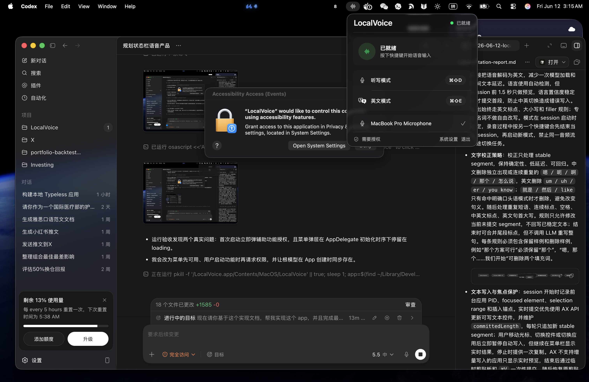
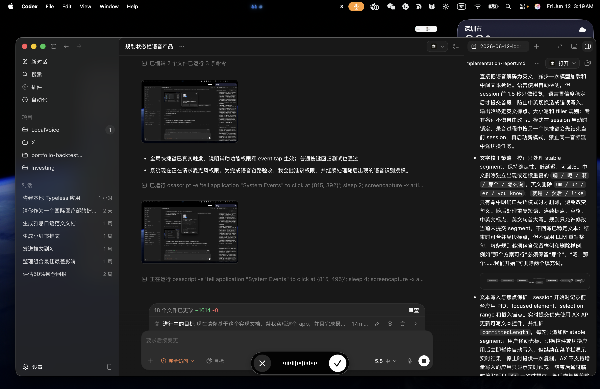

- **交付范围**：首版只有 `听写模式` 与 `英文模式`。默认快捷键为 `⌘⇧D`、`⌘⇧E`，均可在菜单栏点击快捷键胶囊后重新录制。应用没有 Dock 图标、主窗口、账户、历史记录、云端接口或常驻服务。输入语言固定为普通话；英文模式执行普通话到英文的本地翻译。

- **界面方案**：采用方案一 `Focused Utility`。`MenuBarExtra` 宽 `336 pt`，展示当前状态、实时文本、两个模式、快捷键、麦克风、权限与退出。底部 `NSPanel` 为 `248 × 58 pt`，距可见屏幕底边 `36 pt`，不激活应用、不抢输入焦点；左侧取消，中间显示真实 RMS 波形，右侧完成。英文模式将中间三根波形改为紫色。

  

  

- **菜单与快捷键流程**：

  ```mermaid
  flowchart TD
      A["点击菜单栏波形图标"] --> B["查看状态与实时文本"]
      B --> C["听写模式 · ⌘⇧D"]
      B --> D["英文模式 · ⌘⇧E"]
      C --> E["点击快捷键胶囊"]
      D --> E
      E --> F["按下新的组合键"]
      F --> G{"包含修饰键且不重复"}
      G -->|通过| H["写入 UserDefaults 并立即生效"]
      G -->|拒绝| I["显示原因并保留旧值"]
  ```

- **原生技术栈**：Swift 6、SwiftUI、AppKit、AVFoundation、Speech、Translation、NaturalLanguage、ApplicationServices。最低系统为 macOS 26，因为首版直接使用系统本地 `TranslationSession`。不集成 `whisper.cpp` 或 LLM；当前需求的识别、翻译和规则校正由系统框架完成，空闲 RSS 实测约 `70 MB`，识别时约 `80 MB`，明显轻于常驻 Whisper 模型。

- **运行架构**：

  ```mermaid
  flowchart LR
      H["CGEventTap 全局快捷键"] --> S["AppModel / SessionStateMachine"]
      M["AVAudioEngine 麦克风"] --> R["SFSpeechRecognizer zh-CN"]
      R --> P["Partial Result"]
      P --> C["TextCorrector"]
      C --> X["AX Range 原位替换"]
      C --> U["菜单与底部悬浮条"]
      P --> Q["LatestTextBuffer"]
      Q --> T["TranslationSession zh-Hans → en"]
      T --> C
      X --> F["当前应用输入框"]
  ```

- **实时转换**：`SFSpeechAudioBufferRecognitionRequest` 开启 `shouldReportPartialResults` 与 `requiresOnDeviceRecognition`，音频持续送入系统本地识别器。每个 partial 都经过校正并替换当前会话已插入范围，不等待录音结束。识别结果发生回改时覆盖上一版，避免增量追加造成重复。实测普通话听写在说话第 `4 s` 时已写入“今天下午我们”；英文模式第 `5 s` 时已写入 “Let's discuss that tomorrow afternoon.”，停止后原位更新完整句子。

  ```mermaid
  sequenceDiagram
      participant U as 用户
      participant A as AVAudioEngine
      participant S as Speech
      participant T as Translation
      participant X as 当前输入框
      U->>A: 按快捷键并开始说话
      loop 每个部分识别结果
          A->>S: 音频缓冲
          S-->>X: 听写模式原位替换
          S->>T: 英文模式提交最新文本
          T-->>X: 英文结果原位替换
      end
      U->>A: 再按快捷键或点击勾号
      S-->>X: 最终识别与校正
      T-->>X: 最终英文
  ```

- **英文模式调度**：本地翻译只保留一个工作循环。翻译进行时继续接收识别结果，缓冲区只保存最新版本；当前翻译完成后立即处理最新文本，不排队处理中间废弃版本，也不因频繁取消而饿死。中文与英文语言包必须已安装；缺失时停止会话并显示明确错误。

- **文字校正**：规则只做确定性修改。中文删除句首 `嗯 / 呃 / 啊 / 怎么说`，并在有上下文证据时删除口头语 `那个`；“那个方案可行”保留，“那个今天下午开会”改为“今天下午开会”。英文删除 `um / uh / er / well / you know`，修正标点前空格并大写句首。校正作用于完整实时假设，后续识别回改会同步覆盖目标输入框。

- **文本注入与隐私**：会话开始时记录前台应用 PID、focused element 和 selection range。支持 AX 范围写入的控件持续替换当前会话文本；用户切换应用后停止注入。AX 不支持时仅显示实时预览，结束后通过一次临时剪贴板粘贴提交。剪贴板按类型保存为独立数据快照，连续更新共享恢复任务，避免复用 `NSPasteboardItem` 导致崩溃；实测原剪贴板内容在会话后保持不变。所有音频、识别、翻译和校正均在本机完成。

- **验收与限制**：单元测试覆盖快捷键校验、模式状态机、实时结果替换、翻译缓冲合并及中英文校正，共 `14` 项。Xcode Debug 构建通过；普通话听写与中译英均完成 TextEdit 端到端实时测试，进程结束后仍存活。当前限制是 macOS 26、普通话输入、需要麦克风/语音识别/辅助功能权限；Secure Input、密码框和不暴露 AX 文本范围的控件只能实时预览并在结束时粘贴。
