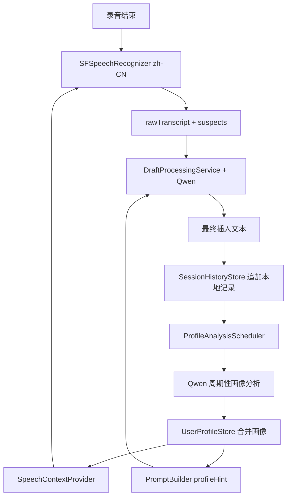

# LocalVoice 中英混杂识别准确率提升方案

日期：2026-06-16
状态：方案文档

## 目标

- 把每次成功插入的内容留存在本地，形成可回放、可分析的个人语料。
- 定期用本地模型从历史记录中提取用户画像，不依赖云端，不增加网络路径。
- 用画像提高中英混杂场景的识别准确率，重点覆盖技术词、产品名、缩写、音译误识别、大小写和拼写变体。
- 保持主路径稳定：录音停止后仍然是 `finalizing -> processing -> inserting -> ready`，画像学习不能阻塞插入。
- 不做隐私开关；本功能默认本地启用，清除本地数据仍然要删除历史记录、画像和派生索引。

## 当前基础

- `UserProfileStore` 已经存在，落盘路径是 `~/Library/Application Support/LocalVoice/profile.json`。
- `ProfileExtractor` 已能从最终文本里提取术语、领域、联系方式和风格统计。
- `ProfileHint` 已能把 glossary 注入 `DraftProcessingService.process(...)` 的 prompt。
- `SpeechRecognitionService` 已从 `SFSpeechRecognitionResult` 提取 `SuspectSpan`，但只覆盖已经被识别成拉丁字母的低置信片段。
- 当前缺口不是“没有画像”，而是画像来源太薄：只看最终输出的统计结果，不保存会话历史，不做模型级归纳，不把高价值词反向喂给 ASR。

## 问题拆解

- `Kubernetes` 被识别成“酷伯内特斯”时，现有 `SuspectSpan` 不会抓到它，因为疑点提取要求片段含拉丁字母。
- `deploy` 被识别成 `employ` 时，现有 suspects 能提供证据，但模型需要更强的上下文和用户领域先验。
- `gRPC`、`localStorage`、`Qwen3-ASR` 这类词即使最终文本正确，ASR 下一次仍然可能听错，因为词表没有注入识别器。
- 只存聚合画像会丢掉可审计证据；后续想判断“这个 alias 是怎么来的”时没有原始上下文。
- 只靠规则提取容易漏掉“我总是在讲 iOS、SwiftUI、App Intents”这类领域信号，模型归纳更适合做周期性画像更新。

## 总体架构



- `SessionHistoryStore` 保存成功会话，作为画像分析的原始材料。
- `ProfileAnalysisScheduler` 在空闲时触发本地模型分析，不占用录音和插入主路径。
- `ProfileAnalysisService` 调用 Qwen，把多条历史记录归纳成结构化画像增量。
- `UserProfileStore` 继续作为画像事实源，负责合并、衰减、落盘和快照。
- `SpeechContextProvider` 从画像里取高价值词，注入 `SFSpeechRecognizer.contextualStrings`。
- `DraftProcessingService` 继续用 `ProfileHint + SuspectSpan` 做后处理纠错。

## 本地留存

- 新增 `SessionHistoryStore`，路径建议为 `~/Library/Application Support/LocalVoice/history/sessions.jsonl`。
- 每行一条 JSONL，追加写入，避免频繁重写大文件。
- 记录字段：`id`、`createdAt`、`mode`、`rawTranscript`、`finalOutput`、`suspects`、`corrections`、`usedFallback`、`targetAppBundleID`、`profileVersionAtUse`。
- 只保存成功插入或明确复制到剪贴板的会话；用户取消、失败、无识别结果不进入历史。
- `rawTranscript` 用于分析 ASR 错误来源；`finalOutput` 用于判断用户最终想要的规范词。
- `suspects` 用于识别“ASR 自己也不确定”的英文片段。
- `corrections` 用于建立“误识别 -> 正确词”的高置信样本。
- 历史文件按月滚动：`sessions-2026-06.jsonl`，读取分析时只扫最近 90 天。
- 硬上限建议 50 MB；超过后删除最旧月份，画像结果不删除。

## 周期性模型分析

- 不按固定时间轮询，按“新增有效会话数 + 空闲状态”触发。
- 触发条件：新增 10 条会话，或距上次分析超过 24 小时且新增 3 条以上。
- 运行条件：当前不录音、不处理、不插入，Qwen 已就绪，未处于模型下载或删除状态。
- 分析窗口：最近 90 天，优先读取上次分析后的新会话，再补充高价值历史样本。
- 单次输入上限：压缩到 12 KB 内，避免画像分析变成长任务。
- 只让模型输出 JSON，不写自然语言总结。
- 分析失败不影响主路径；失败计数写日志，下次满足条件再试。

## 画像提取方法

- 画像不是让模型“自由总结用户”；它是一个证据驱动的本地索引。
- 输入先经过确定性抽取，再交给模型归纳，模型结果最后还要过合并闸门。
- 确定性抽取负责高精度字段：英文术语、大小写表面形式、邮箱、URL、编号、金额、App 名、ASR suspects、模型 corrections。
- 模型归纳负责规则不擅长的字段：音译 alias、领域归属、上下文限定、普通近音词纠错、用户是否倾向保留英文术语。
- 合并闸门负责判断“能不能进入正式画像”，不让模型直接写入 `UserProfile`。
- 每个画像条目都必须绑定 `evidenceSessionIds`，没有证据 ID 的条目直接丢弃。
- 每条证据都保留来源类型：`finalOutputTerm`、`rawTranscriptAlias`、`modelCorrection`、`asrSuspect`、`seedGlossaryMatch`。
- 画像只从用户接受过的结果学习；失败、取消、未插入的会话不参与正向学习。

## 确定性抽取

- `finalOutput` 是规范词的主来源；它代表用户真正插入到目标 App 的结果。
- `rawTranscript` 是误识别和音译 alias 的主来源；它不直接生成 canonical。
- `corrections` 是最高价值证据；它显式表示模型在当次上下文里把 `from` 改成了 `to`。
- `suspects` 是弱证据；它只说明 ASR 不确定，不能单独晋升画像。
- 英文术语候选用正则抽取：大写词、camelCase、全大写缩写、字母数字混合、连字符、点号路径。
- 普通小写英文词默认不进术语表；`deploy`、`schema` 这类词只有在高频语境和 corrections 支持下才进入 `commonCorrections`。
- 中文 alias 候选来自 `rawTranscript` 和 `finalOutput` 的差异：同一会话中 raw 出现“酷伯内特斯”，final 出现 `Kubernetes`，才形成候选。
- 联系方式和 hard facts 只做保护和补全候选，不参与术语纠错。
- 抽取阶段输出的是 `ProfileEvidence`，不是最终画像。

## ProfileEvidence

```json
{
  "sessionId": "...",
  "kind": "rawTranscriptAlias",
  "surface": "酷伯内特斯",
  "canonical": "Kubernetes",
  "contextBefore": "部署到",
  "contextAfter": "上",
  "source": "rawFinalDiff",
  "weight": 0.7
}
```

- `kind` 限定证据类型，避免把 URL、联系人、术语混在一起。
- `surface` 是用户原始语音链路里出现的形式。
- `canonical` 是最终可用于纠错或注入的规范形式。
- `contextBefore/contextAfter` 只保留短窗口，用于判断领域和歧义。
- `source` 标记来源；`modelCorrection` 权重最高，`asrSuspect` 权重最低。
- `weight` 初始由来源决定，再根据模型置信度、会话新鲜度、是否 fallback 调整。

## 模型分析输入

- 模型不读取完整历史文件；`SessionHistoryStore` 先压缩成分析包。
- 分析包按会话组织，保留 raw/final/corrections/suspects 和短上下文。
- 每条会话最多截断到 800 字符；长文本只取含英文词、suspects、corrections 的窗口。
- 对同一 canonical 的重复样本做聚合，保留 3 到 5 条代表证据。
- 分析包包含当前画像摘要，让模型知道已有条目，避免重复输出。
- 分析 prompt 明确要求：只输出有证据支撑的增量；不允许根据职业、身份、偏好做泛化推断。
- 模型只判断“这个词在这个用户的语音输入里怎么写更准确”，不判断用户是什么人。

## 模型输出 Schema

```json
{
  "terms": [
    {
      "canonical": "Kubernetes",
      "surfaces": ["Kubernetes", "kubernetes", "K8s"],
      "aliases": ["酷伯内特斯", "库伯内提斯"],
      "domain": "softwareEngineering",
      "scope": "technicalTerm",
      "confidence": 0.92,
      "support": {
        "sessionCount": 4,
        "correctionCount": 2,
        "rawFinalDiffCount": 3
      },
      "evidenceSessionIds": ["..."]
    }
  ],
  "commonCorrections": [
    {
      "from": "employ",
      "to": "deploy",
      "context": "software release / deployment",
      "scope": "softwareEngineeringOnly",
      "confidence": 0.86,
      "support": {
        "sessionCount": 3,
        "correctionCount": 2
      },
      "evidenceSessionIds": ["..."]
    }
  ],
  "domains": [
    {
      "name": "softwareEngineering",
      "score": 0.88,
      "keywords": ["SwiftUI", "API", "deploy", "schema"]
    }
  ],
  "negativeEvidence": [
    {
      "surface": "deploy",
      "reason": "explicit user contrast: employ vs deploy",
      "evidenceSessionIds": ["..."]
    }
  ],
  "style": {
    "prefersMixedChineseEnglish": true,
    "keepsTechnicalTermsInEnglish": true,
    "emailRate": 0.21
  }
}
```

- `canonical` 是规范写法，必须来自用户最终输出、seed glossary 或多次高置信纠正。
- `aliases` 是音译或误识别形式，只能来自 `rawTranscript` 和 `finalOutput` 的对照。
- `commonCorrections` 处理非专有名词的近音错误，比如 `employ -> deploy`。
- `scope` 限定适用范围；普通近音纠错必须有领域或上下文范围。
- `support` 是机械计数，供合并层复算置信度；不能只信模型自报 confidence。
- `evidenceSessionIds` 必须存在，方便后续调试“为什么学到了这个词”。
- `negativeEvidence` 明确记录“不应该学”的对照样本，防止把用户解释性语句当成偏好。
- `confidence < 0.75` 的条目不进入正式画像，只进入候选池。

## 画像合并规则

- `UserProfile` 增加 `aliases` 和 `commonCorrections` 两类数据。
- 正式词条晋升条件：模型置信度 ≥ 0.75，且至少 2 条不同会话支持，或 seed glossary 命中且 1 条强证据支持。
- 音译 alias 晋升更严格：模型置信度 ≥ 0.85，且 `rawTranscript` 出现 alias、`finalOutput` 出现 canonical。
- 普通英文纠错晋升条件：模型置信度 ≥ 0.85，至少 2 次 `modelCorrection` 支持，且上下文领域一致。
- 普通英文纠错不写入 `contextualStrings`，只进入 prompt 提示和后处理验证。
- `surfaceCounts` 继续决定用户偏好的大小写和写法。
- 90 天未出现的 alias 降权；180 天未出现的候选删除。
- 冲突时保守处理：同一个 alias 指向多个 canonical，只保留置信度最高且证据数最多的映射；差距不明显则全部停用。
- 合并层重新计算 `confidence`，公式建议为 `sourceWeight * sessionDiversity * recency * consistency * modelConfidence`。
- 单会话重复不增加 `sessionDiversity`，避免用户一次长输入把画像刷偏。
- fallback 会话权重减半；没有 finalOutput 对照的 rawTranscript 不生成 alias。
- `negativeEvidence` 命中的条目不晋升，已有正式画像降权。

## 准确性保障

- 双来源原则：正式画像至少需要“最终文本证据 + 模型归纳”或“seed glossary + 最终文本证据”。
- 双会话原则：非 seed 词至少跨 2 个会话；单次会话只进候选池。
- 强证据优先级：用户最终输出 > 模型 corrections > raw/final 差异 > ASR suspects。
- hard facts 保护：URL、邮箱、金额、时间、编号永远不作为术语替换目标。
- 领域限定：`deploy`、`merge`、`schema` 只在软件工程上下文里生效；普通中文听写不使用这些纠错。
- 差异校验：raw/final 对照必须能解释为语音误识别、大小写归一或用户明确改写；解释不了就不学。
- 置信度校准：模型自报 confidence 只占一部分，机械证据不足时不能晋升。
- 回归保护：空画像输出必须与当前链路一致；低置信画像不能改变 prompt。
- 可审计性：每个正式条目能追溯到 evidence session；调试日志只打 ID 和类别，不打全文。

## 防过度偏激

- 画像只影响“怎么识别和保留词”，不推断用户身份、职业、政治倾向、健康状态或长期偏好。
- 用户领域是短期工作上下文，不是人格标签；命名用 `softwareEngineering`，不用“程序员用户”。
- 画像有作用域：`global`、`domain`、`app`、`recent`；默认只给技术术语 `global`。
- 普通词纠错必须带 `domain` 或 `context`，不能全局替换。
- 最近 24 小时内突然高频出现的新词先进入 `recent`，连续跨天出现才晋升为长期画像。
- 同一领域最多占 prompt 画像块的 60%，给其他术语和 hard facts 留空间。
- `contextualStrings` 只注入 canonical，不注入中文 alias，不注入普通纠错对。
- 如果一次画像更新会替换超过 20% 的 prompt hint，分批生效；先启用高置信 top 10。
- 任何条目导致连续 2 次 `CorrectionValidator` 还原或用户取消，立即降权。
- 宁可漏改，不做大范围强改；准确率目标优先级高于召回率。

## ASR 前置增强

- `SpeechContextProvider` 从正式画像中取 top terms，写入 `SFSpeechAudioBufferRecognitionRequest.contextualStrings`。
- 词源优先级：用户正式 glossary > seed glossary 中与当前领域匹配的词 > 最近高置信 corrections。
- 单次注入上限 80 个词，避免识别器负担过大。
- 注入内容只放 canonical 和常用 surface，不放中文 alias。
- 对 `Kubernetes`、`PostgreSQL`、`SwiftUI`、`gRPC`、`localStorage` 这类词，前置注入能减少 ASR 第一跳错误。
- 对 `deploy`、`schema` 这类普通小写词，除非用户近期高频使用，否则不注入，避免污染普通听写。

## 后处理增强

- `PromptBuilder` 注入三块上下文：用户术语表、音译 alias、常见近音纠错。
- 术语表告诉模型“这些词是用户常用词，遇到读音接近的误写时优先纠成它们”。
- alias 表告诉模型“酷伯内特斯”在这个用户语境里大概率是 `Kubernetes`。
- common corrections 告诉模型“软件发布语境里的 employ 可能是 deploy”。
- `CorrectionValidator` 继续要求模型申报 `corrections`，不申报的高风险改写不接受。
- `GlossaryNormalizer` 做最终确定性归一，修大小写、拼写变体和 surface 偏好。
- hard facts 保护区不参与任何替换：URL、邮箱、金额、时间、编号必须逐字保留。

## 冷启动策略

- 第一次使用没有历史，依赖 seed glossary 和 `SuspectSpan`。
- seed glossary 按领域分组，软件工程场景默认包含 Swift、SwiftUI、Kubernetes、PostgreSQL、Redis、gRPC、API、JSON、schema、deploy。
- 用户连续几次出现同一领域后，领域词注入范围扩大。
- 模型分析尚未完成前，已有 `ProfileExtractor` 的规则画像仍然可用。
- 冷启动目标不是一次解决所有英文词，而是让 5 到 10 次成功输入后明显变准。

## 失败和降级

- Qwen 不可用时，不跑周期分析，不影响听写。
- 周期分析 JSON 解码失败时丢弃本次结果，不污染画像。
- ASR 不支持 `contextualStrings` 或注入无效时，只降级到现有后处理链。
- 画像为空时，prompt 与当前行为保持一致。
- 画像冲突时宁可不改，不做猜测式替换。
- 插入失败不进入历史，避免把未被用户接受的文本学进去。

## 文件改动建议

- `Sources/LocalVoiceCore/SessionHistory.swift`：新增历史记录模型、JSONL 编解码、滚动文件策略。
- `Sources/LocalVoiceCore/ProfileEvidence.swift`：新增证据模型、来源权重、短上下文和证据去重。
- `Sources/LocalVoiceCore/ProfileAnalysis.swift`：新增模型分析 schema、合并策略、置信度规则、负证据处理。
- `Sources/LocalVoiceCore/UserProfile.swift`：扩展 `aliases`、`commonCorrections`、领域分数和 evidence 引用。
- `Sources/LocalVoiceCore/DraftProcessing.swift`：扩展 `ProfileHint` prompt，加入 alias 和 common corrections。
- `Sources/LocalVoiceApp/SessionHistoryStore.swift`：actor，负责追加会话、读取分析窗口、压缩输入。
- `Sources/LocalVoiceApp/ProfileAnalysisScheduler.swift`：空闲触发、节流、失败重试。
- `Sources/LocalVoiceApp/SpeechContextProvider.swift`：从画像生成 `contextualStrings`。
- `Sources/LocalVoiceApp/SpeechRecognitionService.swift`：创建 request 后注入 contextual strings。
- `Sources/LocalVoiceApp/AppModel.swift`：成功插入后写 history，空闲时触发分析，处理前取增强画像。
- `Tests/LocalVoiceCoreTests/ProfileEvidenceTests.swift`：覆盖证据抽取、权重、去重、短上下文截断。
- `Tests/LocalVoiceCoreTests/ProfileAnalysisTests.swift` 和 `SessionHistoryTests.swift`：覆盖 schema、合并、冲突、滚动、上限。

## 实施顺序

- 先做 `SessionHistoryStore`，只追加本地 JSONL，不接入模型分析。
- 接着做 `ProfileEvidence`，把 raw/final/corrections/suspects 转成证据列表。
- 然后扩展 `UserProfile`，把 aliases 和 common corrections 的合并规则写成纯函数。
- 再做 `ProfileAnalysisService`，用 fake model 跑 schema、负证据和合并测试。
- 接 `SpeechContextProvider`，把高价值词注入 ASR。
- 最后接 prompt 增强、过度纠错回滚和端到端验收。
- 每一步都能独立回滚，不能把历史留存、模型分析、ASR 注入绑成一次大改。

## 验收语料

- `我想把这个服务 deploy 到 Kubernetes 上`，不应输出 `employ` 或“酷伯内特斯”。
- `这个 SwiftUI view 里面 localStorage 的 schema 要 migration`，保留 `SwiftUI`、`localStorage`、`schema`、`migration`。
- `我们用 gRPC 调 PostgreSQL 后面的 API`，保留 `gRPC`、`PostgreSQL`、`API`。
- `Qwen3-ASR 这次识别 SenseVoice 的 benchmark`，保留 `Qwen3-ASR`、`SenseVoice`、`benchmark`。
- `把 branch merge 回 main`，不应输出 `march`。
- `Redis cache miss 之后 fallback 到 local model`，保留 `Redis`、`cache miss`、`fallback`、`local model`。
- `https://kubernetes.io/docs 这个 URL 不要改`，URL 必须逐字不变。
- `订单 LV-2048 的预算是 ¥1200.50`，编号和金额必须逐字不变。
- `今天下午三点帮我 remind 一下 Max review PR`，保留 `remind`、`Max`、`review PR`，不能过度翻译成全中文。
- `把这个 employ 的地方改成 deploy`，不能把用户明确说的对照关系误消除。

## 验收指标

- 历史留存：成功插入 10 次后，本地 JSONL 有 10 条记录，字段完整，App 重启后仍可读取。
- 证据抽取：`finalOutputTerm`、`rawTranscriptAlias`、`modelCorrection`、`asrSuspect` 四类证据都有单测；URL、金额、编号不会进入术语候选。
- 主路径延迟：stop 到 insert 的 P95 不因 history 追加增加超过 20 ms；周期分析不在录音和插入期间运行。
- 周期分析：新增 10 条记录后，空闲状态下触发一次分析，输出 JSON 可解码，失败不污染画像。
- 画像质量：技术词 canonical 提取准确率 ≥ 95%，alias 误收录率为 0，所有正式条目都有至少 2 个 evidence session 或 seed glossary 强证据。
- 置信度校准：模型 confidence 高但机械证据不足的条目只进候选池，不进入正式画像。
- 负证据：`把 employ 改成 deploy` 这类解释性语句不会生成全局 `employ -> deploy` 偏好。
- ASR 前置：有画像后，`contextualStrings` 至少包含 top 20 个用户术语，且不包含低置信 alias。
- 中英混杂准确率：验收语料中技术词保留准确率 ≥ 90%，hard facts 保留准确率 100%。
- 音译纠错：`酷伯内特斯 -> Kubernetes`、`库伯内提斯 -> Kubernetes` 在有画像后通过率 ≥ 80%。
- 普通近音纠错：`employ -> deploy`、`march -> merge` 在软件工程语境下通过率 ≥ 80%。
- 误改写：不含画像词的中文普通句子不得被强行插入英文术语。
- 防过度偏激：同一领域占 prompt 画像块不超过 60%；普通近音纠错离开领域上下文不得生效。
- 存储上限：历史文件超过 50 MB 后自动删除最旧月份，画像文件不丢失。

## 手工验收流程

- 清空本地 history 和 profile，启动 packaged app。
- 连续输入 10 条软件工程中英混杂语料，让系统积累历史。
- 等待空闲分析触发，检查 profile 中出现 `Kubernetes`、`SwiftUI`、`gRPC`、`PostgreSQL` 等 terms。
- 再输入含音译和近音错误的语料，确认最终插入文本使用 canonical。
- 查看日志，确认分析发生在空闲期，不与录音、处理、插入重叠。
- 断开模型或让 Qwen 不可用，确认听写仍可完成，只是不做周期分析。
- 注入满画像后跑现有 corpus，确认空画像回归和 hard facts 保护不变。

## 不做的事

- 不增加云端上传、账号同步、远程分析。
- 不增加本地个性化开关。
- 不让模型直接覆盖画像；所有模型输出必须经过 schema、置信度、证据和冲突检查。
- 不把中文 alias 注入 `contextualStrings`，避免 ASR 更偏向中文音译。
- 不把普通低频英文词长期固化，避免用户偶然说错一次后污染后续输入。
